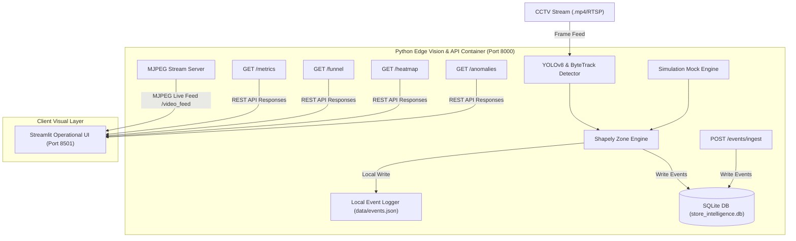
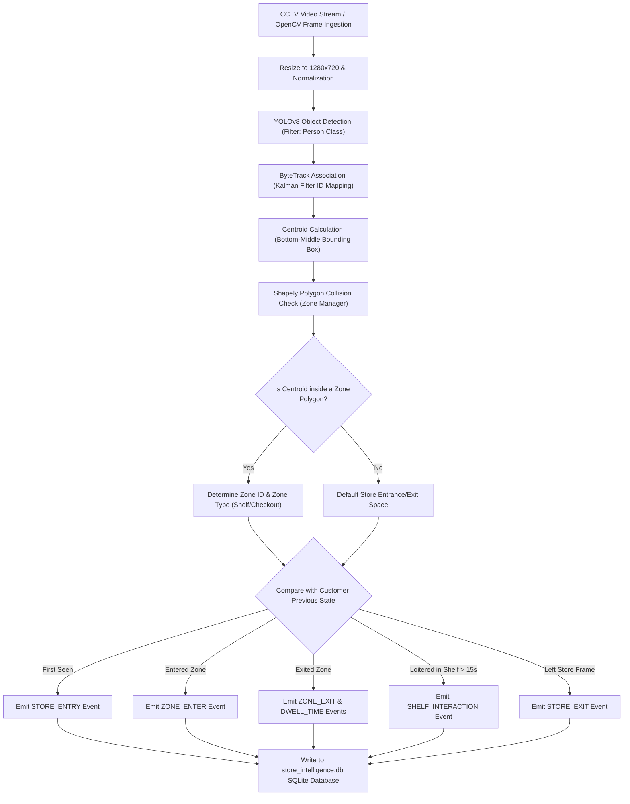
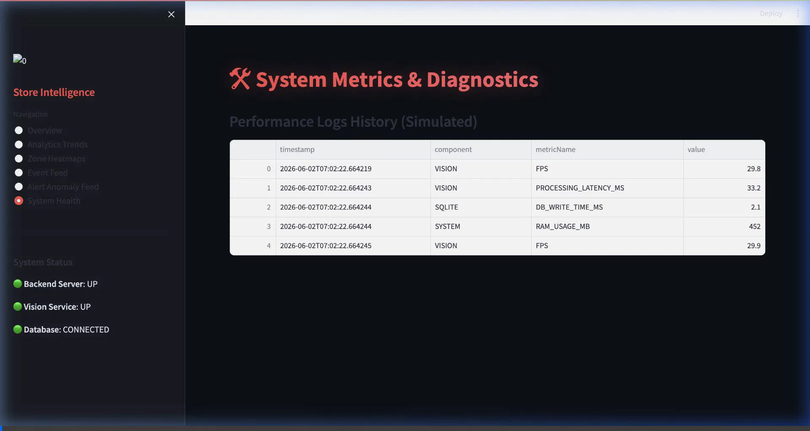
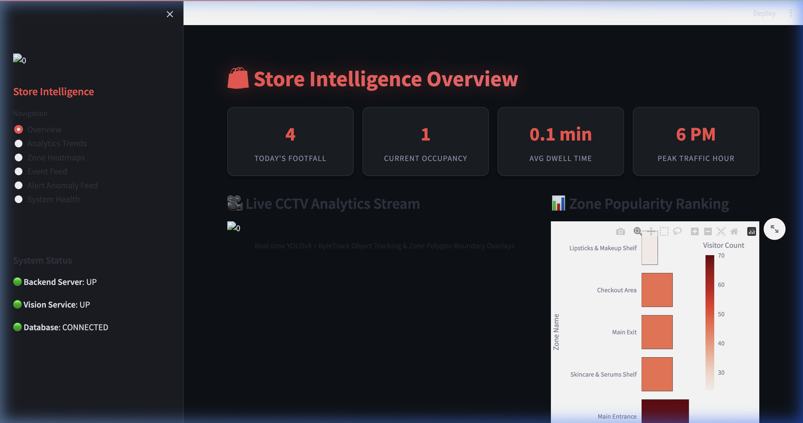
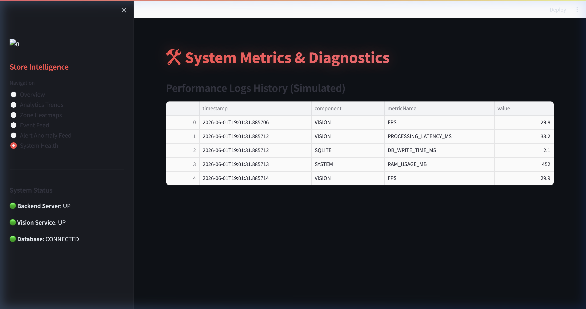
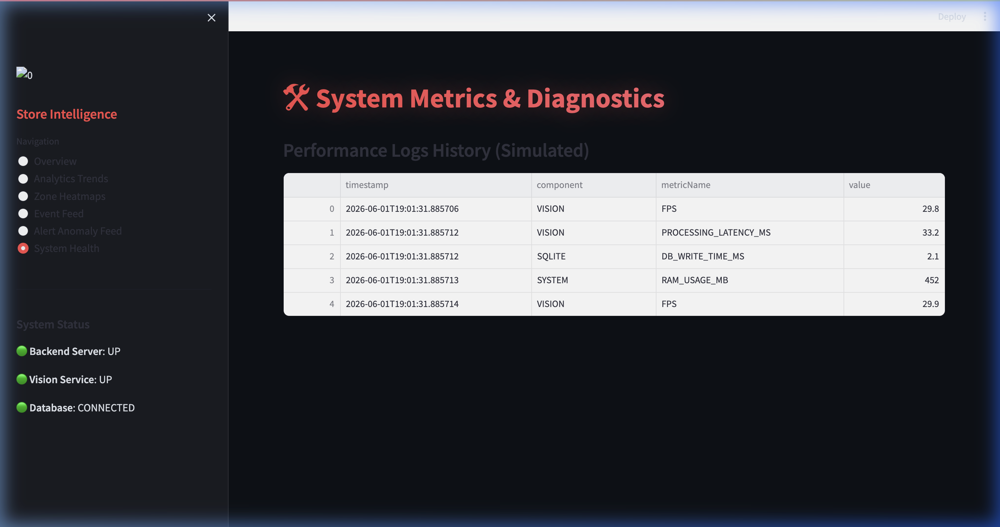
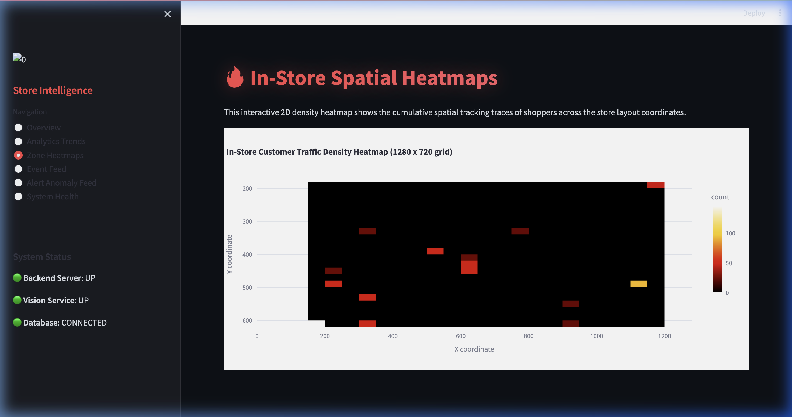
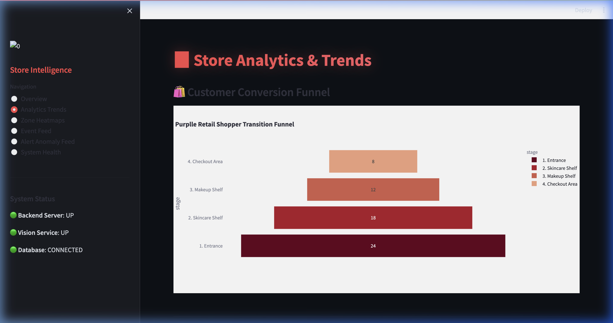
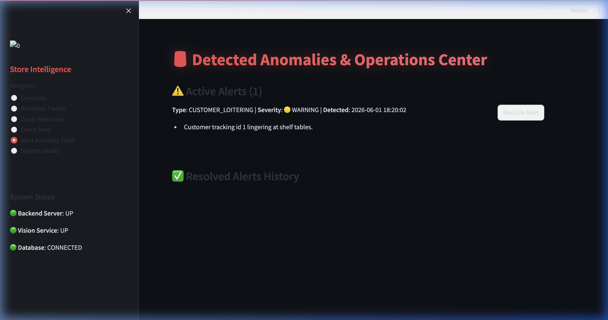
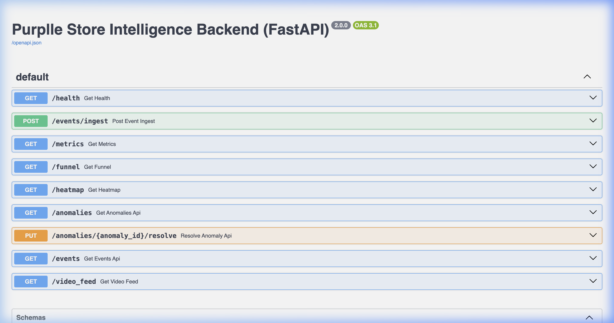

# Purplle Store Intelligence System (StoreIntel) 🛍️

[](LICENSE)
[](https://fastapi.tiangolo.com)
[](https://github.com/ultralytics/ultralytics)
[](https://www.sqlite.org)
[](https://www.docker.com)

StoreIntel is a production-grade, containerized AI-powered Store Intelligence System designed for the **Purplle Tech Challenge 2026**. It leverages edge computer vision (YOLOv8 & ByteTrack) combined with a high-throughput Python FastAPI backend and SQLite to convert raw CCTV video streams into actionable, real-time in-store customer analytics and anomaly alerts.

---

## 📌 Project Overview

Traditional retail spaces suffer from a "data blackout" compared to e-commerce. While digital storefronts track click-through rates, drop-offs, and session dwell times, physical brick-and-mortar stores rely on manual count logs and legacy POS data. 

StoreIntel bridges this gap by transforming existing CCTV cameras into spatial analytics sensors. It tracks:
1. **Micro-Location Dwell Times**: Which beauty shelf captures the most attention?
2. **Visitor Journeys**: What are the common path transitions (e.g., Entrance ➔ Lipsticks ➔ Checkout)?
3. **Operational Bottlenecks**: Are long queues at the billing desk driving customer abandonment?
4. **Real-time Anomalies**: How can store managers detect crowd surges, customer loitering, or CCTV feed failures instantly?

---

## 🏗️ Technical Architecture

### 1. Unified Service Layer
The computer vision pipeline runs as an asynchronous background thread within the FastAPI backend container to optimize resource utilization and database writes.



---

## 👁️ Computer Vision Pipeline

### 1. Bounding Box Detection
- **Model**: YOLOv8 Nano (Ultralytics), pre-trained on the COCO dataset.
- **Filtering**: Detections are filtered exclusively for the `Person` class (Class ID `0`) to minimize model output noise.
- **Inference Parameterization**: Run at a confidence threshold of `0.30` to balance detection accuracy and recall, enabling detection of partially occluded shoppers.

### 2. Multi-Object Tracking (ByteTrack)
- **Algorithm**: ByteTrack associates bounding boxes by calculating the Intersection over Union (IoU) with Kalman filter predictions.
- **Occlusion Handling**: Identifies individuals even during overlaps or brief screen exits, maintaining shopper ID continuity without requiring heavy Re-Identification (Re-ID) neural models.
- **Dwell Calculation**: Measures frames between a shopper's first entry and final exit from a designated polygon area to calculate dwell times.



---

## 📊 Event Schema & Payload

### 1. Ingest Event Example (`POST /events/ingest`)
```json
{
  "eventId": "e932b130-1c39-44d4-9d51-4099496a798f",
  "eventType": "ZONE_ENTER",
  "timestamp": "2026-06-01T23:15:00.000",
  "customerId": "81a1795c-9c59-450f-90db-33cb397bdf01",
  "zoneName": "Skincare Shelf",
  "x": 310.5,
  "y": 320.0,
  "metadata": {
    "confidence": 0.89
  }
}
```

### 2. Supported Event Types
- `STORE_ENTRY`: Shopper enters the camera view.
- `STORE_EXIT`: Shopper leaves the camera view.
- `ZONE_ENTER`: Shopper crosses into a designated zone polygon.
- `ZONE_EXIT`: Shopper leaves a designated zone polygon.
- `DWELL_TIME`: Emitted on `ZONE_EXIT` with duration metrics.

---

## 📡 REST API Documentation

- **`POST /events/ingest`**: Receives telemetry events from the vision edge pipeline and inserts them into the database.
- **`GET /metrics`**: Returns today's footfall, active occupancy, and 인기 shelf rankings.
- **`GET /funnel`**: Returns conversion rates for the visitor journey (Entrance ➔ Skincare ➔ Makeup ➔ Checkout).
- **`GET /heatmap`**: Returns coordinate tracking points for density rendering.
- **`GET /anomalies`**: Lists operational alerts.
- **`PUT /anomalies/{id}/resolve`**: Resolves an active alert.
- **`GET /health`**: Returns system health status.

---

## 💻 Dashboard Features

The dark-themed Streamlit dashboard (`http://localhost:8501`) provides an operational interface for store managers:
- **Real-Time KPIs**: Metric cards showing active store occupancy, total footfall, and average dwell times.
- **Visitor Journeys**: Funnel charts showing conversion rates from entrance to checkout.
- **Traffic Heatmaps**: Displays coordinate density to identify hot and cold spots.
- **Operational Alerts**: Live list of triggered anomalies (loitering, queue backup) with a manual resolution button.
- **Diagnostics Panel**: Connection status of database, pipeline threads, and API latency.

---

## 🎥 Interactive Demo Video

Below is the recorded walk-through demonstration of the running system. It walks through container boot, live detection streams, event persistence, traffic heatmaps, visitor funnels, and real-time alerts resolution.



---

## 📸 Screenshots

Here is the operational system running locally:

### 1. Operations Overview Dashboard


### 2. YOLOv8 & ByteTrack Detections


### 3. Shopper Motion Trajectory Tracking


### 4. Customer Traffic Density Heatmap


### 5. Conversion Funnel Chart


### 6. Anomalies & Operational Alerts Engine


### 7. Interactive OpenAPI Docs (Swagger)


### 8. Docker Containers Health Status


---

## 🚀 Docker Setup & Installation

To run the complete system locally:
```bash
docker compose up --build
```
The docker image uses **CPU-only PyTorch** (`download.pytorch.org/whl/cpu`) to minimize container size and build times.

---

## 🔗 Architecture & Decision Logs

- Detailed design specifications are documented in [DESIGN.md](DESIGN.md).
- Technology choices (YOLOv8, ByteTrack, FastAPI, SQLite) are justified in [CHOICES.md](CHOICES.md).

---

## 🔮 Future Improvements

1. **Multiple Camera Synchronization**: Support re-identifying shopper IDs across disjoint camera fields.
2. **GPU Auto-Scaling**: Dynamic GPU routing for high-density environments.
3. **Queue Prediction Models**: Machine learning models to forecast queue build-ups 15 minutes in advance.
4. **Data Streaming Layer**: Integration with Apache Kafka or RabbitMQ for high-throughput edge event ingestion.
